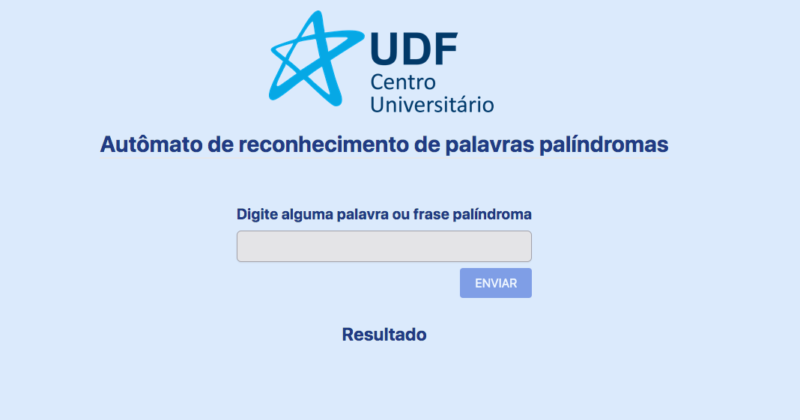
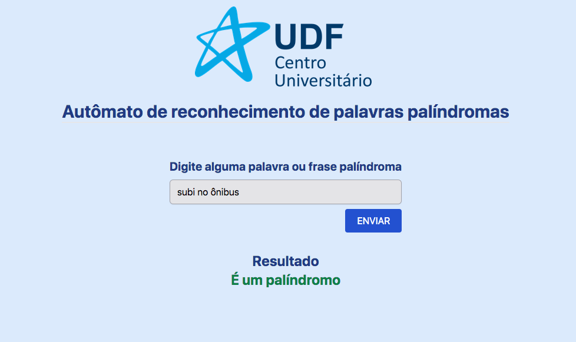
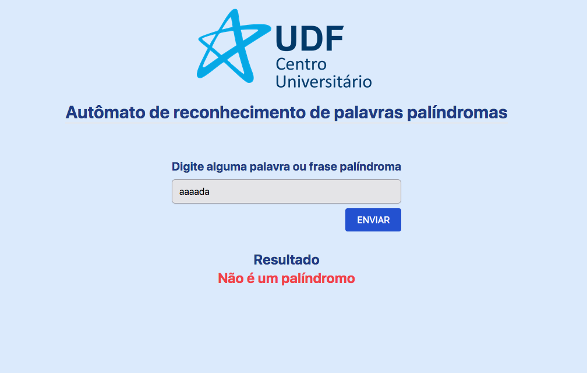

# Reconhecedor de palindRômos

## Sobre 

Este foi um projeto da faculdade para a matéria de Linguagem Formais e Autômatos. 
O objetivo deste projeto é verificar se uma palavra ou frase é considerada um palíndromo.  
Um palíndromo é uma sequência de caracteres que pode ser lida da mesma forma tanto da esquerda para a direita quanto da direita para a esquerda. 
O presente trabalho foi feito com as bibliotecas React e Tailwindcss.

## Uso da aplicação
 
<strong>Tela inicial</strong>
  

Nesta tela é possível inserir um texto e enviar para a validação de panlíndromo.

 
<strong>Exemplo de frase palíndroma</strong>
  

Se for digitado uma frase que seja um palíndromo, será exibido uma mensagem informando que é um palíndromo

 
<strong>Exemplo de frase não palíndroma</strong>
  

Se for digitado uma frase que não seja um palíndromo, será exibido uma mensagem informando que não é um palíndromo